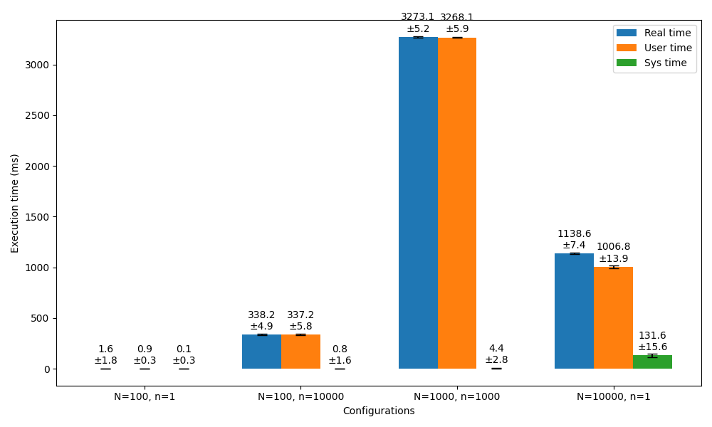
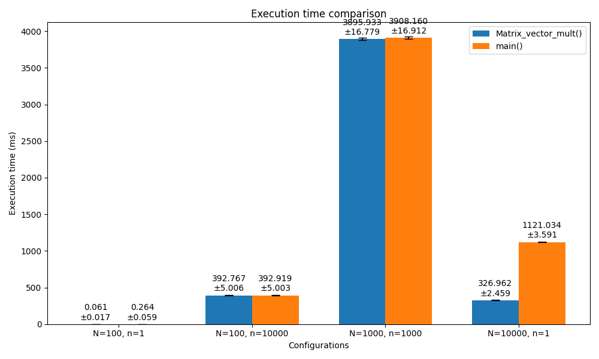
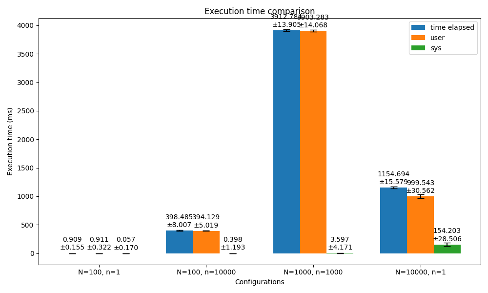
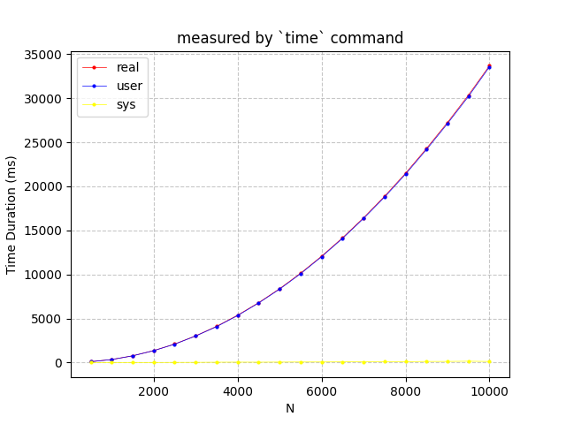
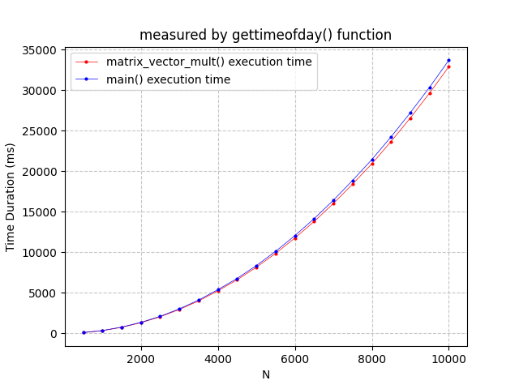
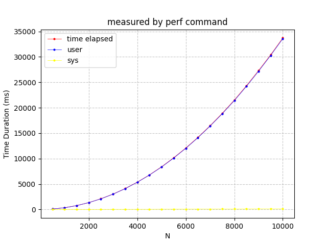
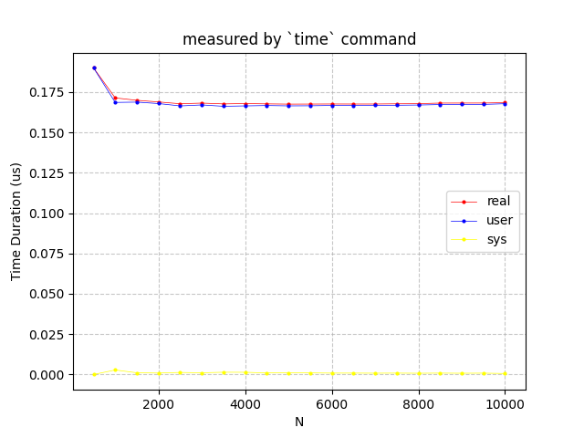
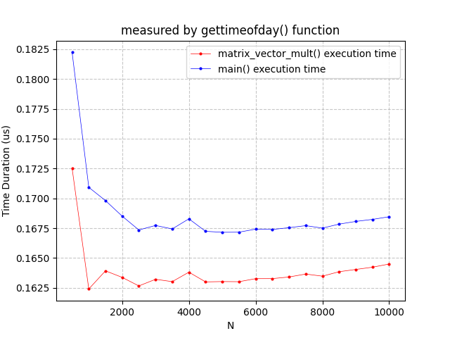
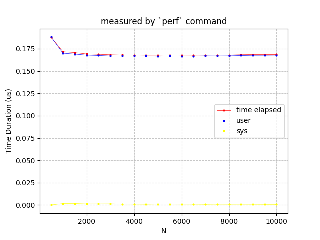

Experimental Environment
=
Platform: Github Workspace

- Host name
```bash
$  hostname
codespaces-4bf82d
```
- CPU manufacturer, model, and clock rate.
```bash
$ lscpu
Vendor ID:  AuthenticAMD
Model name: AMD EPYC 7763 64-Core Processor
CPU MHz:    3242.790
```
- Number of physical cores and logical cores
```bash
$ cat /proc/cpuinfo | grep "cpu cores" | uniq
cpu cores       : 1
$ cat /proc/cpuinfo | grep "processor" | wc -l
2
```
- Cache configuration: number of cache levels, capacity and line size in each level
```bash
$ lscpu
L1d cache:                          32 KiB
L1i cache:                          32 KiB
L2 cache:                           512 KiB
L3 cache:                           32 MiB
$ getconf LEVEL1_ICACHE_LINESIZE
64
$ getconf LEVEL1_DCACHE_LINESIZE
64
$ getconf LEVEL2_CACHE_LINESIZE
64
$ getconf LEVEL3_CACHE_LINESIZE
64
```
- OS and kernel version  

| Name | Value |
|--|--|
| Kernel | 6.5.0-1025-azure |  
| OS | Ubuntu 20.04.6 LTS |
```bash
$ uname -a
Linux codespaces-4bf82d 6.5.0-1025-azure #26~22.04.1-Ubuntu SMP Thu Jul 11 22:33:04 UTC 2024 x86_64 x86_64 x86_64 GNU/Linux
$ cat /etc/os-release
NAME="Ubuntu"
VERSION="20.04.6 LTS (Focal Fossa)"
ID=ubuntu
ID_LIKE=debian
PRETTY_NAME="Ubuntu 20.04.6 LTS"
```
- GCC version
```bash
$ gcc --version
gcc (Ubuntu 9.4.0-1ubuntu1~20.04.2) 9.4.0
```

Task2: Measurement: Precision and Accuracy
=
Server: Brooks
- Execution time measured by bash builtin command: `time`
<!-- | unit: `ms`| N=100, n=1 | N=100, n=10000 | N=1000, n=1000 | N=10000, n=1 |
|--|--|--|--|--|
| Real time| $\bar{x}$=1.6, $\sigma$=1.8| $\bar{x}$=338.2, $\sigma$=4.9| $\bar{x}$=3273.1, $\sigma$=5.2| $\bar{x}$=1138.6, $\sigma$=7.4|
| User time| $\bar{x}$= 0.9, $\sigma$=0.3| $\bar{x}$= 337.2, $\sigma$=5.8| $\bar{x}$= 3268.1, $\sigma$=5.9| $\bar{x}$= 1006.8, $\sigma$=13.9|
|Sys time| $\bar{x}$= 0.1, $\sigma$=0.3| $\bar{x}$= 0.8, $\sigma$=1.6| $\bar{x}$= 4.4, $\sigma$=2.8| $\bar{x}$= 131.6, $\sigma$=15.6| -->


- Execution time measured by C function: `getitmeofday()`
<!-- 
| unit: `ms` | N=100, n=1 | N=100, n=10000 | N=1000, n=1000 | N=10000, n=1 |
|--|--|--|--|--|
|`Matrix_vector_mult()` execution time| $\bar{x}$=0.0605585, $\sigma$=0.0165303 | $\bar{x}$=392.7667616, $\sigma$=5.0062123 | $\bar{x}$=3895.9326031, $\sigma$=16.7790822 | $\bar{x}$=326.9620180, $\sigma$=2.4586872|
|`main()` execution time|$\bar{x}$=0.2638577, $\sigma$=0.0586828| $\bar{x}$=392.9192068, $\sigma$=5.0025366|$\bar{x}$=3908.1603289, $\sigma$=16.9117782|$\bar{x}$=1121.0340977, $\sigma$=3.5908434| -->



- Execution time measured by `perf`

<!-- | unit: ms | N=100, n=1 | N=100, n=10000 | N=1000, n=1000 | N=10000, n=1 |
|--|--|--|--|--|
|time elapsed|$\bar{x}$=0.9090013, $\sigma$=0.1550954|$\bar{x}$=398.4850314, $\sigma$=8.0070536|$\bar{x}$=3912.7837895, $\sigma$=13.9054069|$\bar{x}$=1154.6938224, $\sigma$=15.5785001|
|user|$\bar{x}$=0.9106000, $\sigma$=0.3217832|$\bar{x}$=394.1294000, $\sigma$=5.0185379|$\bar{x}$=3903.2827000, $\sigma$=14.0676060|$\bar{x}$=999.5430000, $\sigma$=30.5616751|
|sys|$\bar{x}$=0.0565000, $\sigma$=0.1695000|$\bar{x}$=0.3978000, $\sigma$=1.1934000|$\bar{x}$=3.5968000, $\sigma$=4.1711241|$\bar{x}$=154.2028000, $\sigma$=28.5064551| -->




- What do the numbers say about the precision and accuracy of the measurement methods?
      - Common characteristic: the precision of all methods are degrading with the increase of matrix size and number of repeatation.
      - `time` command: 
     those experiment with less repeat times(n=1) have larger standard deviation, the more repeat times, the smaller standard deviation is.
      - `gettimeofday()` function: have the lowest standard deviation on (N=100, n=1)
      - precision: the stand devation also increase with the increase of matrix size.
      - standard deviation is smaller than other measurement method, high precision is demostrated
      - `perf` command: the precision is the worst on large size matrix(N=10000, n=1
).

      - the best accuracy can be seen on `gettimeofday()` function as it's measuring the run time of specific function, and nontrival distrub can be isolated. This phoenomenon is obvious on small size computation. 

||Precision|Accuracy|
|--|--|--|
|`time`| ||
|`gettimeofday()`|the precision of `time` command result is degrading with the increase of input size. ||
|`perf`|the precision of `time` command result is degrading with the increase of input size. ||
2. Which method would you choose? Why?
3. What is effect of input size on measurement accuracy?
4. Is there any value to repeating the computation for measurement precision and accuracy?


Task3: Performance Normalization
=
Server: brooks
|`time` command:  |`gettimeofday()` function|`perf` command|
|--|--|--|
|  |  ||


|`time` command:  |`gettimeofday()` function|`perf` command|
|--|--|--|
|  |  ||


Here, I use time per flop for performance  normalization
 - `time` command:  

- `gettimeofday()` function:  

- `perf` command:  


Task4: Analysis with `perf`
=