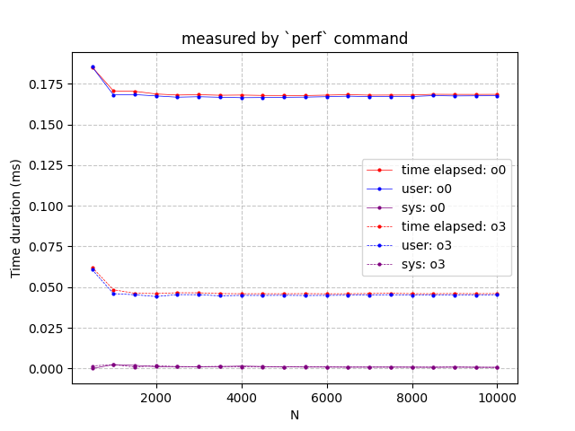

# HPC Homework 0

Lei Zhao

## Task 1: Experimental Environment
Platform: Github Workspace

- Host name
```bash
$  hostname
codespaces-4bf82d
```
- CPU manufacturer, model, and clock rate.
```bash
$ lscpu
Vendor ID:  AuthenticAMD
Model name: AMD EPYC 7763 64-Core Processor
CPU MHz:    3242.790
```
- Number of physical cores and logical cores
```bash
$ cat /proc/cpuinfo | grep "cpu cores" | uniq
cpu cores       : 1
$ cat /proc/cpuinfo | grep "processor" | wc -l
2
```
- Cache configuration: number of cache levels, capacity and line size in each level
```bash
$ lscpu
L1d cache:                          32 KiB
L1i cache:                          32 KiB
L2 cache:                           512 KiB
L3 cache:                           32 MiB
$ getconf LEVEL1_ICACHE_LINESIZE
64
$ getconf LEVEL1_DCACHE_LINESIZE
64
$ getconf LEVEL2_CACHE_LINESIZE
64
$ getconf LEVEL3_CACHE_LINESIZE
64
```
- OS and kernel version  

| Name | Value |
|--|--|
| Kernel | 6.5.0-1025-azure |  
| OS | Ubuntu 20.04.6 LTS |
```bash
$ uname -a
Linux codespaces-4bf82d 6.5.0-1025-azure #26~22.04.1-Ubuntu SMP Thu Jul 11 22:33:04 UTC 2024 x86_64 x86_64 x86_64 GNU/Linux
$ cat /etc/os-release
NAME="Ubuntu"
VERSION="20.04.6 LTS (Focal Fossa)"
ID=ubuntu
ID_LIKE=debian
PRETTY_NAME="Ubuntu 20.04.6 LTS"
```
- GCC version
```bash
$ gcc --version
gcc (Ubuntu 9.4.0-1ubuntu1~20.04.2) 9.4.0
```

## Task 2: Measurement: Precision and Accuracy
Server: Brooks

- Execution time measured by bash builtin command: `time`
<!-- | unit: `ms`| N=100, n=1 | N=100, n=10000 | N=1000, n=1000 | N=10000, n=1 |
|--|--|--|--|--|
| Real time| $\bar{x}$=1.6, $\sigma$=1.8| $\bar{x}$=338.2, $\sigma$=4.9| $\bar{x}$=3273.1, $\sigma$=5.2| $\bar{x}$=1138.6, $\sigma$=7.4|
| User time| $\bar{x}$= 0.9, $\sigma$=0.3| $\bar{x}$= 337.2, $\sigma$=5.8| $\bar{x}$= 3268.1, $\sigma$=5.9| $\bar{x}$= 1006.8, $\sigma$=13.9|
|Sys time| $\bar{x}$= 0.1, $\sigma$=0.3| $\bar{x}$= 0.8, $\sigma$=1.6| $\bar{x}$= 4.4, $\sigma$=2.8| $\bar{x}$= 131.6, $\sigma$=15.6| -->


- Execution time measured by C function: `getitmeofday()`
<!-- 
| unit: `ms` | N=100, n=1 | N=100, n=10000 | N=1000, n=1000 | N=10000, n=1 |
|--|--|--|--|--|
|`Matrix_vector_mult()` execution time| $\bar{x}$=0.0605585, $\sigma$=0.0165303 | $\bar{x}$=392.7667616, $\sigma$=5.0062123 | $\bar{x}$=3895.9326031, $\sigma$=16.7790822 | $\bar{x}$=326.9620180, $\sigma$=2.4586872|
|`main()` execution time|$\bar{x}$=0.2638577, $\sigma$=0.0586828| $\bar{x}$=392.9192068, $\sigma$=5.0025366|$\bar{x}$=3908.1603289, $\sigma$=16.9117782|$\bar{x}$=1121.0340977, $\sigma$=3.5908434| -->


- Execution time measured by `perf`

<!-- | unit: ms | N=100, n=1 | N=100, n=10000 | N=1000, n=1000 | N=10000, n=1 |
|--|--|--|--|--|
|time elapsed|$\bar{x}$=0.9090013, $\sigma$=0.1550954|$\bar{x}$=398.4850314, $\sigma$=8.0070536|$\bar{x}$=3912.7837895, $\sigma$=13.9054069|$\bar{x}$=1154.6938224, $\sigma$=15.5785001|
|user|$\bar{x}$=0.9106000, $\sigma$=0.3217832|$\bar{x}$=394.1294000, $\sigma$=5.0185379|$\bar{x}$=3903.2827000, $\sigma$=14.0676060|$\bar{x}$=999.5430000, $\sigma$=30.5616751|
|sys|$\bar{x}$=0.0565000, $\sigma$=0.1695000|$\bar{x}$=0.3978000, $\sigma$=1.1934000|$\bar{x}$=3.5968000, $\sigma$=4.1711241|$\bar{x}$=154.2028000, $\sigma$=28.5064551| -->


1. **What do the numbers say about the precision and accuracy of the measurement methods?**  
 `gettimeofday()` offers the highest precision and accuracy, particularly for small tasks, as it isolates and measures the execution time of specific functions. `Perf` provides good system-level precision and accuracy but includes some overhead. `time` has the lowest precision and accuracy, as it captures overall system performance, including unrelated tasks.

2. **Which method would you choose? Why?**  
My choice would be perf because the command is simple to use, and it provides various metrics that help me understand the reasons for performance degradation.

3. **What is effect of input size on measurement accuracy?**  
As the input size increases, the measurement accuracy tends to decrease. Larger input sizes lead to longer execution times, during which more system-level events, such as background processes or CPU scheduling, can interfere with the measurement. When the matrix becomes too large to fit in the cache, cache misses occur, slowing down the computation and adding further variability to the results. Additionally, methods like `time` and `perf` might capture more unrelated system activities, further impacting accuracy.

4. **Is there any value to repeating the computation for measurement precision and accuracy?**
Yes, repeating the computation improves precision and accuracy by reducing random variability and accounting for system-level interference.


## Task3: Performance Normalization

Measure tool: `perf`  

  

1. **What can we say about performance scalability of matrix-vector multiplication?**  
The performance scalability of matrix-vector multiplication depends on several factors, such as matrix size, hardware capabilities, and memory access patterns. As the matrix size grows, the computation becomes more intensive, and performance may degrade due to increased memory access time, especially when the matrix exceeds the cache size, leading to cache misses. This can slow down the process significantly.  
As the input size increases, the computation time also increases (as expected). However, what we are more concerned with is the variation in execution time for a fixed number of FLOPs, or the execution time per flop, as this is the key metric for evaluating performance scalability.

  

2. **What can we say about performance scalability of matrix-vector multiplication using this new metric?**  
I designed a new metric, which is the execution time per flop. Here, I roughly estimate the total FLOPs as \( 2N^2 \). It can be observed that for N=1000 compared to N=500, the time per flop decreases significantly. Between N=1000 and N=2000, there is a slow decline, and after N=2000, it remains almost unchanged. I believe that the reason for the time reduction when N < 2000 is that the overhead related to initialization (such as reading from the hard drive and loading the program into cache) is relatively fixed, and as N increases, this initialization overhead is amortized.  
The fact that the graph remains mostly unchanged indicates that the matrix-vector program demonstrates good performance scalability for N < 10000.

## Task4: Analysis with `perf`  


1. **Which version of the code is performing better?**  
The binary file generated with the `O3` optimization level is performing better.
-   

2. **Which areas of performance saw an improvement?**  

The performance analysis using perf reveals several factors contributing to O3's faster execution:

**Instruction Count is the main contribution**: `O3` reduces the total instructions executed, improving efficiency by eliminating redundant instructions.

**L1 Data Cache Miss Rate increases under O3 optimization, L1 Cache is a bottleneck for the `O3` optimized code**: `O3` optimizations(Loop unrolling and function inlining) reduce branch instructions, meantime lead to **poor locality and higher cache pressure**, especially if loop bodies grow too large and exceed the L1 cache's capacity. What's more, `O3` optimized code runs faster and more compactly, this can **increase memory bandwidth demands**. If L1 cache bandwidth can't keep up, the L1-dcache miss rate may rise.

**Summary**: LLC-loads and LLC-load-misses are unavailable on  brooks (CPU: AMD EPYC 7v13). However, the server provides cache-misses data, which includes the sum of all cache-misses from L1, L2, and L3 caches. It can be observed that when comparing `O0` and `O3` optimization levels, the differences of cache miss rate, L1-icache miss rate, branch miss rate, and page fault count are all quite small. The probability of CPU migrations per execution is negligible under both optimization levels. The advantage of the reduced instruction count outweighs the disadvantage of the increase in L1 data cache miss rate, which is why the code with `O3` optimization executes faster.

- Insight Figure 1: cache miss rate at each level  
  

- Insight Figure 2: instructions count per flop  
  

- Insight Figure 3: page fault count per kflops  
  

- Insight Figure 4: cpu migrations count per execution  

