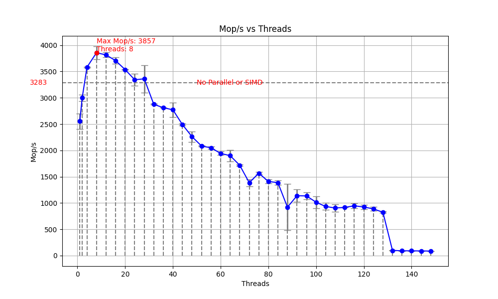
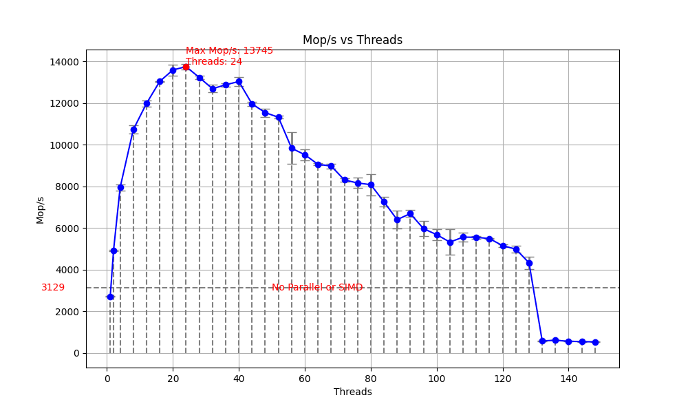
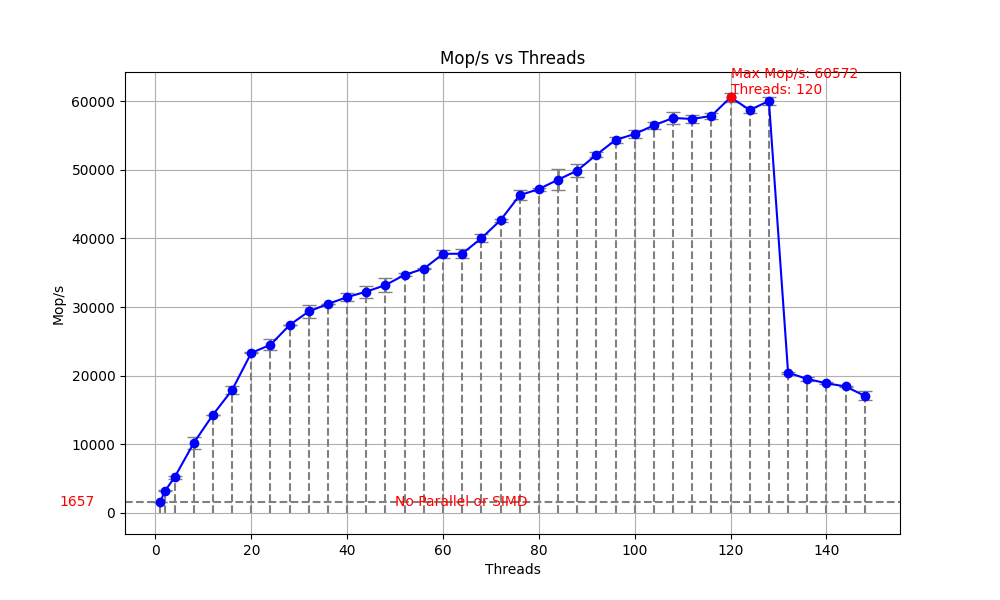

# Problem Size
| class | Noof Attr | Noof Non-Zero | Noof Iter | Shift |
|-------|-----------|---------------|-----------|-------|
| S     | 1400      | 7             | 15        | 10.0  |
| W     | 7000      | 8             | 15        | 12.0  |
| A     | 14000     | 11            | 15        | 20.0  |
| B     | 75000     | 13            | 75        | 60.0  |
| C     | 150000    | 15            | 75        | 110.0 |


# Server Details
`AMD EPYC 7V13` supports the following SIMD and vector-related instruction sets: `sse` `sse2` `ssse3`  `sse4_1` `sse4_2`   `sse4a` `misalignsse` `avx` `avx2`
| Specification     | Value                     |
|-------------------|---------------------------|
| Host              | brooks                    |
| Model name        | AMD EPYC 7V13 64-Core     |
| Core(s) per socket| 64                        |
| Socket(s)         | 2                         |
| Support Hyper-Threading  | Yes                        |
| Hyper-Threading enabled?  | No                        |
| Thread(s)         | 128                       |


# Experiments Details
## Rolled Version

|conf | description|
|-------------------|---------------------------|
|`baseline`| without parallelization or SIMD (shown as a grey horizontal line on each figure)|
|`conf_rolled_1`:|As many `simd` parallelization directives as possible|
|`conf_rolled_2`|As many `parallel for simd` parallelization directives as possible|
|`conf_rolled_3`|As many `parallel for` parallelization directives as possible|

**Attention**: 
- in order to save time, I repeated `conf_rolled_1` with each conbination of `CLASS` and `thread numbers` 10 times to obtain the mean `Mop/s` and its standard deviation. For `conf_rolled_2` and `conf_rolled_3, I only repeated for 2 times.

- `#pragma omp` is ignored in following tables to save space

|for loop | `conf_rolled_1` | `conf_rolled_2`| `conf_rolled_3`|
|--|--|--|--|
| 1st     | `simd`                            | `parallel for simd`                    | `parallel for`                    |
| 2nd     | `simd reduction(+ : rho)`         | `parallel for simd reduction(+ : rho)` | `parallel for reduction(+ : rho)` |
| 3rd     | Not Parallelized                  | Not Parallelized            		       | Not Parallelized            		   |
| -4th    | `parallel for private(k, sum)`    | SAME as LEFT      		                 | SAME as LEFT     		             |
| --5th   | Not Parallelized                  | Not Parallelized                       | Not Parallelized                  |
| -6th    | `simd`                            | `parallel for simd`                    | `parallel for`                    |
| -7th    | `simd`                            | `parallel for simd`                    | `parallel for`                    |
| -8th    | `simd reduction(+ : d)`           | `parallel for simd reduction(+ : d)`   | `parallel for reduction(+ : d)`   |
| -9th    | `simd`                            | `parallel for simd`                    | `parallel for`                    |
| -10th   | `simd reduction(+ : rho)`         | `parallel for simd reduction(+ : rho)` | `parallel for reduction(+ : rho)` |
| -11th   | `simd`                            | `parallel for simd`                    | `parallel for`                    |
| 12th    | `parallel for private(k, d)`      | SAME as LEFT            				       | SAME as LEFT              			   |
| -13th   | Not Parallelized                  | Not Parallelized                       | Not Parallelized                  | 
| 14th    | `simd`                            | `parallel for simd`                    | `parallel for`                    |
| 15th    | `simd reduction(+ : sum)`         | `parallel for simd reduction(+ : sum)` | `parallel for reduction(+ : sum)` |

### CLASS=S

### CLASS=W

### CLASS=A

### CLASS=B

### CLASS=C


# My Thoughts

1. Why are the following 2 nested loops not suitable for SIMD?   
```#pragma omp parallel for private(k, sum) // omp_flags_4_
    for (j = 1; j <= lastrow - firstrow + 1; j++)
    {
      sum = 0.0;
      for (k = rowstr[j]; k < rowstr[j + 1]; k++) 
      {
        sum = sum + a[k] * p[colidx[k]];
      }
      w[j] = sum;
    }
```
```
#pragma omp parallel for private(k, d) // omp_flags_12_
  for (j = 1; j <= lastrow - firstrow + 1; j++)
  {
    d = 0.0;
    for (k = rowstr[j]; k <= rowstr[j + 1] - 1; k++)
    {
      d = d + a[k] * z[colidx[k]];
    }
    w[j] = d;
  }
```  
Because `p[colidx[k]]` and `z[colidx[k]]` involves indirect memory access and the data is not contiguous, the above 2 nested loops are not suitable for SIMD.

2. Why is the 3rd for loop not suitable for parallelization?   
Because the following variables depend on results from previous iterations, if we add a parallel directive to the 3rd for loop, multiple threads will read from and write to these variables simultaneously, leading to incorrect results.
`rho0 = rho;`  
`alpha = rho0 / d;`  
`beta = rho / rho0;`  
`p[j] = r[j] + beta * p[j];`  
`z[j] = z[j] + alpha * p[j];`  
`r[j] = r[j] - alpha * q[j];`  

3. SIMD vs parallel   
When the problem size is small, SIMD can provide greater performance improvements (because SIMD has low overhead). As the problem size increases, the performance improvement from parallelization becomes more significant (since SIMD processing power becomes insufficient for larger problems, and the overhead of thread management in parallel can be amortized). The performance of `parallel for` and `parallel for simd` is roughly the same.


#  Analysis and Discussion

1. What is the maximum speedup your code is able to achieve on top of the baseline sequential version? Clearly indicate what you consider to be the baseline.   
The baseline I have chosen is the config without parallelization or SIMD (shown as a grey horizontal line on each figure). The maximum speedup for each class is shown below. The speedup ratio is calculated as the maximum speed (Mop/s) divided by the baseline speed (Mop/s).

| class | max speedup | threads num | config |
|-------|---------------|---------------------------|----------------------|
| S     | 2.69x         | 36                        | conf_rolled_1: mostly simd |
| W     | 5.59x         | 48                        | conf_rolled_1: mostly simd |
| A     | 9.30x         | 40                        | conf_rolled_2: mostly parallel for simd |
| B     | 24.30x        | 80                        | conf_rolled_2: mostly parallel for simd |
| C     | 32.10x        | 124                       | conf_rolled_3: mostly parallel for |


2. Do the performance improvements meet your expectations? Why or why not?   
The results align with my expectations in terms of parallel efficiency: larger problems benefit significantly from parallelism,  smaller ones suffer from parallel overhead.

3. What is the optimal number of threads for CG on your system? Why?   
The optimal number of threads for each class is shown in the table above. From this, we can conclude that:  
- As the size of the problem increases, more threads are required to fully exploit the advantages of parallelism, leading to a higher speedup ratio.
- For smaller problems, the parallelization overhead is relatively significant compared to the computational workload, so the optimal number of threads is smaller.


# Optional

1. Evaluate how loop unrolling affects the performance of parallel codes. Unrolled versions of one of the loops in conj-grad is given in comments in the source file. Run these versions, and possibly add your own, and compare the parallel performance with the rolled version.  
As we can see from the above tables, the performance is basically unchanged for large-sized problems. For small-sized problems (Class S), there is a slight improvement in performance.


## Unrolled Version


|conf | description|
|-------------------|---------------------------|
|`conf_unrolled_by2`|unrolled by 2|
|`conf_unrolled_by8`|unrolled by 8|


| for loop | `conf_unrolled_by2` | `conf_unrolled_by8` |
|--|--|--|
| 1st     | `parallel for`                    | `parallel for`                     |
| 2nd     | `parallel for reduction(+ : rho)` | `parallel for reduction(+ : rho)`  |
| 3rd     | Not Parallelized         		      | Not Parallelized                   |
| -4th    | `parallel for private(j, k)`      | `parallel for private(j, k, sum)`  |
| --5th   | `simd reduction(+:sum1, sum2)`    | `simd reduction(+ : sum)`                             |
| -6th    | `parallel for`                    | `parallel for `                    |
| -7th    | `parallel for`                    | `parallel for `                    |
| -8th    | `parallel for reduction(+ : d)`   | `parallel for reduction(+ : d)`    |
| -9th    | `parallel for`                    | `parallel for `                    |
| -10th   | `parallel for reduction(+ : rho)` | `parallel for reduction(+ : rho)`  |
| -11th   | `parallel for`                    | `parallel for `                    |
| 12th    | `parallel for private(k, d)`      | `parallel for private(k, d)`       |
| -13th   | Not Parallelized                  | Not Parallelized                   |
| 14th    | `parallel for`                    | `parallel for `                    |
| 15th    | `parallel for reduction(+ : sum)` | `parallel for reduction(+ : sum)`  |

**Attention**:
- To facilitate comparison with the `unrolled_by2` version, I have ignored the for loop following the 4th for loop in the `unrolled_by8` code, and treated the 6th for loop as the 5th for loop, and so on. 
- The for loop I just mentioned cannot be parallelized.
- in order to save time, I repeated `conf_unrolled_by2_1` and `conf_unrolled_by8_1` with each conbination of `CLASS` and `thread numbers` 2 times to obtain the mean `Mop/s` and its standard deviation.
- The details of `conf_rolled_3` have been ilustrated in previous tables.


|CLASS|  `conf_rolled_3` | `conf_unrolled_by2` | `conf_unrolled_by8`|
|--|--|--|--|
|S||||
|W||||
|A||||
|B||||
|C||||

